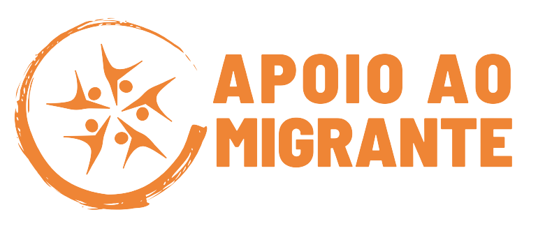

# Apoio ao Migrante

## Sobre
____________________________________________________________________
Este é um projeto, realizado com o objetivo de que todos os migrantes recém-chegados ao Brasil, por quaisquer motivos, possam obter a melhor orientação possível para suas preocupações, seja trabalho, local, benefícios sociais, estadia, etc. Incluindo uma comunidade funcional e interativa para que eles possam fazer perguntas objetivas e adaptadas às suas necessidades.

## Execução
____________________________________________________________________
A pessoa soamente deve acesar no sigente link:

(https://apoio-ao-migrante.vercel.app/) ou atravez de QR:

Agora sem permitam-me destacar algumas _características-chave_ que fazem de **APOIO AO MIGRANTE** uma ferramenta indispensável  e facil navegacao:
 
Em primer lugar temos o **Home**:

Em **QUEM SOMOS**, a pessoa pode encontrar e contatar através de nossas redes sociais, pessoas humanistas que estão dispostas a ajudar nesta nova etapa de vida.

No segundo lugar, **ORGANISMOS DE APOIO**:
 nosso site disponibiliza uma variedade de recursos práticos como informações sobre Organismos de apoio, locais, nacionais e internacionais, os quais  estão intimamente envolvidos na prestação de benefícios socioeconómicos aos migrantes e refugiados no país. 
 
No terceiro lugar, temos secao **EMPREGABILIDADE**: 
site oferece informacoes sobre emprego e educacao, fornecemos orientacao de como preparar um curriculo,  falamos do programa Joven Aprendis e como obter a carteira de trabalho.

Na secao de **CAPACITACAO**: 
 fornecemos informacoe de Organismos que oferecen cursos de graca, capacitacao profissional e de idioma portuguez,  ferramenta que facilitara a adaptação a Maria em sua nova comunidade.

Por ultimo, como cereja do bolo temos uma **COMUNIDADE**:
Uma ves _AUTENTICADO_ a pessoa vai acesar a conunidade, onde terá a oportunidade de interagir dinamicamente com outras pessoas, oportunidade de conexão com outros migrantes, para que possam compartilhar suas experiências, fazer perguntas, procurar emprego, a comunidade pode fornecer informações sobre oportunidades de trabalho de curto prazo e contratação rápida.

***Queremos que o site seja acessível a todos, independentemente do dispositivo utilizado.***

